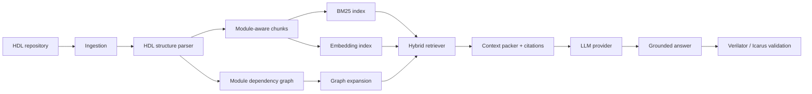

# HDL-RepoPilot

面向 Verilog/SystemVerilog 代码仓库的结构感知检索与问答框架：结合 BM25、可插拔向量检索和模块依赖图，为回答提供精确到文件与行号的引用，并预留 HDL 编译验证与自动修复接口。

> Structure-aware hybrid retrieval and grounded Q&A for Verilog/SystemVerilog repositories.

## 为什么不是普通 RAG Demo

普通文档 RAG 通常把代码按固定字符切分，再进行向量 Top-K。HDL-RepoPilot 首先提取代码结构：

- module、端口和 parameter
- module instance 与父子模块依赖
- 源文件与起止行号
- module-aware 代码块

检索时组合三类信号：

```text
BM25 lexical retrieval
        +
Dense embedding retrieval
        +
Module dependency graph expansion
        ↓
Grounded context with file:line citations
```

## 当前框架能力

- Verilog/SystemVerilog、Markdown、TXT 和可选 PDF 导入
- module-aware HDL 分块与稳定内容 ID
- 模块实例化依赖图，可双向展开父模块和子模块
- BM25 + Dense + Graph 加权混合检索
- 离线 Hash Embedding，零 API 配置即可跑通框架
- OpenAI-compatible API 与 Sentence Transformers Embedding 接口
- Provider-neutral LLM 接口
- 回答上下文携带 `[SOURCE path:start-end]` 引用
- Verilator / Icarus Verilog 验证接口
- CLI、可选 Gradio UI、示例 RTL、单元测试和 CI

## 架构



## 快速开始

需要 Python 3.11 或更高版本。

```bash
python -m venv .venv
# Linux/macOS
source .venv/bin/activate
# Windows PowerShell: .venv\Scripts\Activate.ps1

pip install -e .
```

### 1. 索引示例 RTL

```bash
hdl-repopilot index examples/mini_rtl
```

默认索引保存在 `.repopilot/index.json`。Hash Embedding 仅用于离线运行和框架测试，正式实验应切换到代码或文本 Embedding 模型。

### 2. 离线混合检索

```bash
hdl-repopilot search "Which module implements the counter width parameter?"
```

示例输出包含检索分数和引用：

```text
1. counter.sv:1-15 score=...
2. top.sv:1-14 score=...
```

### 3. 查看模块依赖图

```bash
hdl-repopilot graph
```

```text
top -> counter
```

### 4. 使用 LLM 生成带引用回答

安装 API 客户端并设置凭据：

```bash
pip install -e ".[llm]"

# Linux/macOS
export LLM_API_KEY="your-key"

# Windows PowerShell
$env:LLM_API_KEY="your-key"
```

可通过环境变量配置 OpenAI-compatible endpoint 和模型：

```bash
export LLM_BASE_URL="https://your-provider.example/v1"
export LLM_MODEL="your-code-model"
hdl-repopilot ask "Explain how reset reaches the counter module"
```

### 5. 启动 Gradio UI

```bash
pip install -e ".[llm,ui]"
hdl-repopilot serve --host 127.0.0.1 --port 7860
```

### 6. 编译或 Lint HDL

安装 Verilator 或 Icarus Verilog 后：

```bash
hdl-repopilot validate examples/mini_rtl/counter.sv
```

## Embedding Provider

默认配置不需要下载模型：

```bash
export EMBEDDING_PROVIDER="hash"
```

OpenAI-compatible Embedding：

```bash
export EMBEDDING_PROVIDER="openai"
export EMBEDDING_MODEL="text-embedding-v3"
export EMBEDDING_DIMENSIONS="1024"
hdl-repopilot index /path/to/hdl/repository
```

本地 Sentence Transformers：

```bash
pip install -e ".[local-embeddings]"
export EMBEDDING_PROVIDER="sentence-transformers"
export EMBEDDING_MODEL="your-local-model"
hdl-repopilot index /path/to/hdl/repository
```

索引时和查询时必须使用相同的 Embedding Provider。

## 项目结构

```text
src/hdl_repopilot/
├── config.py       # 环境变量与运行配置
├── models.py       # 领域数据结构
├── hdl_parser.py   # HDL 结构解析接口与初始实现
├── ingestion.py    # 仓库扫描与 module-aware 分块
├── graph.py        # 模块依赖图
├── embeddings.py   # 可插拔 Embedding Provider
├── index.py        # 可移植索引快照
├── retrieval.py    # BM25 + Dense + Graph
├── context.py      # 上下文预算与引用
├── llm.py          # Provider-neutral LLM 接口
├── validator.py    # Verilator / Icarus
├── pipeline.py     # 高层工作流
├── cli.py          # CLI
└── ui.py           # 可选 Gradio UI
```

## 测试

```bash
python -m unittest discover -s tests -v
ruff check .
```

## 当前边界

这是框架阶段，暂不声明检索或生成效果优于基线：

- 当前 HDL Parser 是轻量实现，下一阶段会替换为 tree-sitter、slang 或其他完整语法前端。
- 本地索引采用便于调试和版本控制的 JSON 快照，尚未接入生产向量数据库。
- 编译验证接口已经存在，但自动读取错误并二次修复的 Agent Loop 尚未实现。
- 尚未构建带 gold file/line 的评测集，也尚未进行消融实验。

## 下一阶段路线

1. AST/语法树后端与增量索引
2. Reranker 与更可靠的上下文压缩
3. 信号路径、模块依赖和影响分析工具
4. 编译错误解析与自动修复循环
5. Recall@K、MRR、引用准确率、编译率和 testbench 通过率评测
6. Dense-only、Hybrid、Graph-augmented 消融实验

## 安全说明

- API Key 只从环境变量读取，`.env` 不会提交。
- 如果凭据曾提交到 Git 历史，应立即在服务商处吊销和轮换；删除当前文件中的字符串不能使旧凭据恢复安全。

## License

尚未指定开源许可证。在所有者确认原始代码与数据授权范围前，请不要将本项目视为已授权再分发的软件。
